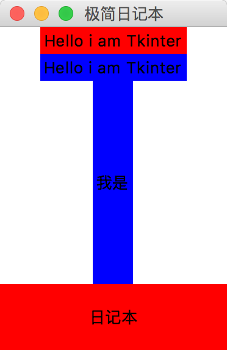

# 极简交互式日记的桌面版本

####任务
在上周开发基础上, 完成 极简交互式日记的桌面版本

**需求如下:**

- 每次运行时合理的打印出过往的所有日记
- 一次接收输入一行日记
- 保存为本地文件
- 时限: 1wd4~2wd3
- 发布: 发布到各自仓库的 _src/om2py2w/2wex0/ 目录中
- 指标:
    - 包含软件使用说明书: README.md
    - 能令其它学员根据说明书,运行系统,完成所有功能
- 备选的:
    - 如果有余力, 或是对桌面软件没有兴趣, 
    - 请尝试相同的功能要求在 ipython notebook 中实现
    - 用网页的交互来替代桌面软件的感觉?

#### 完成任务思路:

* 了解 Tkinter
* 安装 Tkinter
* 画桌面版的框架图
* 列出界面元素
* 重点学习相关的Tkinter模块

##了解 Tkinter

[24.1. Tkinter — Python interface to Tcl/Tk](https://docs.python.org/2.7/library/tkinter.html)

[IDLE and tkinter with Tcl/Tk on Mac OS X | Python.org](https://www.python.org/download/mac/tcltk/)

[An Introduction To Tkinter](http://effbot.org/tkinterbook/tkinter-index.htm)

[Tkinter reference: a GUI for Python](http://infohost.nmt.edu/tcc/help/pubs/tkinter)

这些是是大妈给的参考链接, 说实话看着真的很晕, 特别是在关于 Tkinter背景一点都不了解的情况下, 尝试着看了一部分, 但还是不好理解.
于是自己动手找了一些中文的参考资料, 先了解一下大概的情况, 再看英文文档可能效率更高一些.

####Tkinter 到底是什么东东? 能干什么?
简单的说就是图形界面,下面这个鬼东西就是用 Tkinter 实现的.

看到这个界面应该就能明白到底能干什么了吧, 实现可视化的交互.

##安装 Tkinter
Tkinter需要安装吗?
 
答案是:**不需要**

Tkinter优点很明显，是一个已经半官方化的工具包，可以直接使用，无需安装，并且教程众多，几乎所有介绍 Python 入门的书，只要提及 GUI 设计都会讲 Tkinter

缺点一样明显，设计出的 GUI 很难看，要问多难看，你自己看看 Python 的那个 IDLE 就好了，土的掉渣啊，而且元件一样很少，如果只是编写一些小程序的话还可以，如果编写大程序要用到比较复杂的元件的话，就需要从提供的元件里找一些替代品了，手工输入代码，有时候很累啊。

##Tkinter 的基本语法

