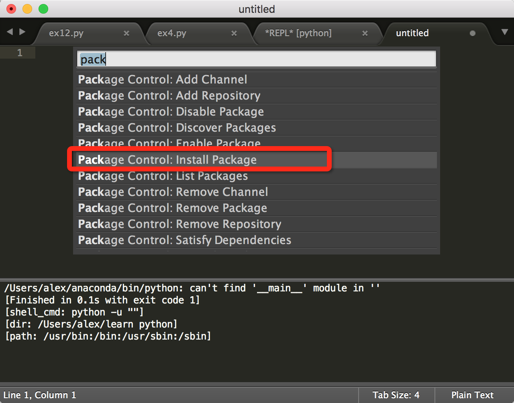

# Sublime text3环境设置
### 引子
俗话说，工欲善其事，必先利其器，其实Sublime text已经下载很久了，自学python的时候也仅仅是把他当成普通的代码编辑器，运行python的 .py文件时候仍然在终端中通过python语句执行。
今天才发现原来可以直接在Sublime text中通过command+B（我的电脑环境：macbook pro + OSX 10.11 EL Capitan）执行。囧！！！


### 遇到的问题
但是在执行笨办法学python第12可的题（ex12.py）时遇到了问题，如下图红框部分。


**问题：**
通过command+B执行时提示报错，内容如下：
``EOFError: EOF when reading a line``

**原因分析：**
google到Sublime中本身无法直接运行包含input或raw_input的代码，也就是说无法进行输入的交互。

**解决方案： **
安装SublimeREPL插件，它支持在 Sublime 中运行python交互式开发环境。

>SublimeREPL是Sublime Text 的一个插件，它除了可以使你在ST中运行解释器（REPL：REPL就是read-evaluation-print-loop，解释型语言编译运行的过程）），还有对Python语言的特别支持，包括在本地/远程（远程仅在linux/osx平台可用）virtualenv中启动Python，快速运行选中的代码或者启动PDB等。 

### 安装插件

#### 第0步：先安装install Package，这个是Sublime Text 的插件包管理器。

这里又遇到了问题，查到的大多数安装方法如下：
>1. Shift+Command+P，输入Package Control

>2. 选择Package Control：install Package

>3. 重启Sublime text 


但是，按照步骤搜索不到install Package。

**问题：**无法按照常规的办法搜索到install Package，这样也就没有办法安装插件包管理器。

**分析：**通过关键词"Sublime text + package cintrol"搜索到一篇文章[《Sublime text 2/3 中 Package Control 的安装与使用方法》](http://www.imjeff.cn/blog/62/)解决这个问题。

>因为 Sublime Text 3 更新了 Python 的函数，API不同了，导致基于 Python 开发的插件很多都不能工作，Package Control 原来的安装方法都失效了。

**解决方案:** 
>从菜单 View - Show Console 或者 ctrl + ~ 快捷键，调出 console。将以下 Python 代码粘贴进去并 enter 执行，不出意外即完成安装。以下提供 ST3 和 ST2 的安装代码：

Sublime Text 3：
```
import urllib.request,os; pf = 'Package Control.sublime-package'; ipp = sublime.installed_packages_path(); urllib.request.install_opener( urllib.request.build_opener( urllib.request.ProxyHandler()) ); open(os.path.join(ipp, pf), 'wb').write(urllib.request.urlopen( 'http://sublime.wbond.net/' + pf.replace(' ','%20')).read())
```

Sublime Text 2：

```
import urllib2,os; pf='Package Control.sublime-package'; ipp = sublime.installed_packages_path(); os.makedirs( ipp ) if not os.path.exists(ipp) else None; urllib2.install_opener( urllib2.build_opener( urllib2.ProxyHandler( ))); open( os.path.join( ipp, pf), 'wb' ).write( urllib2.urlopen( 'http://sublime.wbond.net/' +pf.replace( ' ','%20' )).read()); print( 'Please restart Sublime Text to finish installation')
```

通过上述方式成功安装install Package，如果没有成功安装的可以查看原文中的手动安装方法。

#### 第1步：安装插件SublimeREPL
安装方法有三种：
1. 通过上面刚安装的install Package进行安装
2. 下载插件手动安装
3. 通过git安装

尝试了第1、2种方法，第三种有点复杂暂时没有尝试。

**第1种方法安装步骤：**
1. 再次 Shift+Command+P，输入'install Package'，点击 Package Control: Install Package
2. 再搜索关键词SublimeREPL，找到对应的插件点击安装。
3. 等待安装完成，底部状态栏会有提示。

**第2种方法安装步骤：**
1. 从github下载插件

    [SublimeREPL Github下载地址](https://github.com/wuub/SublimeREPL)
点击右边的"**Download Zip**"下载插件

    另外，发现了一个
[Sublime text插件查询网站](https://packagecontrol.io/packages/SublimeREPL)，有插件的下载统计，详细说明，排行，下载地址等等

2. 打开finder，使用快捷键shift +command+G调出输入框，输入以下内容，直接进入Sublime text Package文件夹

    ```
     ~/Library/Application Support/Subime Text 3/Packages```
    
    

3. 将下载的插件拉入到此文件夹中并解压
4. 重启Sublime text

#### 第2步：运行ex12.py
上面的插件安装好后就可以运行包含input或raw_input的.py程序了。

插件运行路径：Tools > SublimeREPL > Python > Python-RUN current file


到此其实已经成功的解决了Sublime text下python的交互输入问题。


**问题又来了，这个操作路径太深，如果每次都这么操作会比较麻烦，是否有快捷键的方式？**

搜索"SublimeREPL"还真有人讨论这个问题，但是大部分都是在win下的解决方案，很少看到mac下的解决方法，试了几个可能有效地方法，但都**没有成功**，比如通过配置Key Bindings-Users设定F5为快捷方式。

打开 Sublime Text > Preferences > Key Bindings - User，在文件中输入：
``` 
[
    {
        "keys": ["f5"],
        "caption": "SublimeREPL: Python - RUN current file",
        "command": "run_existing_window_command",
        "args": {
            "id": "repl_python_run",
            "file": "config/Python/Main.sublime-menu"
        }
    }
]
```


最后从stackoverflow找到一条相关的问题的解答，测试有效。
[How to create a keyboard shortcut for SublimeREPL?](http://stackoverflow.com/questions/19181999/how-to-create-a-keyboard-shortcut-for-sublimerepl)

方法基本和上面的一样，只不过代码有一些差别，不知道是因为删除了一些代码，还是快捷键的设定不一样的原因，添加以下代码后通过快捷键ctrl+alt+b可以直接使用。

有效代码如下：

```
[
    { 
        "keys": ["ctrl+alt+b"],
        "command": "run_existing_window_command", 
         "args":{
            "id": "repl_python_run",
            "file": "config/Python/Main.sublime-menu"
         }
    }

]
```

stackoverflow问题的一楼答案也很巧妙，通过Mac系统的快捷键设置也可以达到同样的效果。


---

主要参考文档：

[Sublime text 2/3 中 Package Control 的安装与使用方法](http://www.imjeff.cn/blog/62/)

[Sublime Text for Mac 使用配置](http://blog.yzyzsun.me/sublime-text-for-mac/)

[How to create a keyboard shortcut for SublimeREPL?](http://stackoverflow.com/questions/19181999/how-to-create-a-keyboard-shortcut-for-sublimerepl)

[Python 学习之一：在Mac OS X下基于Sublime Text搭建开发平台包含numpy，scipy](http://blog.csdn.net/songrotek/article/details/46453073)

[SublimeREPL：在Sublime Text 2中运行解释器](http://hao.jobbole.com/sublimerepl/)

[Package Control](https://packagecontrol.io/installation)


