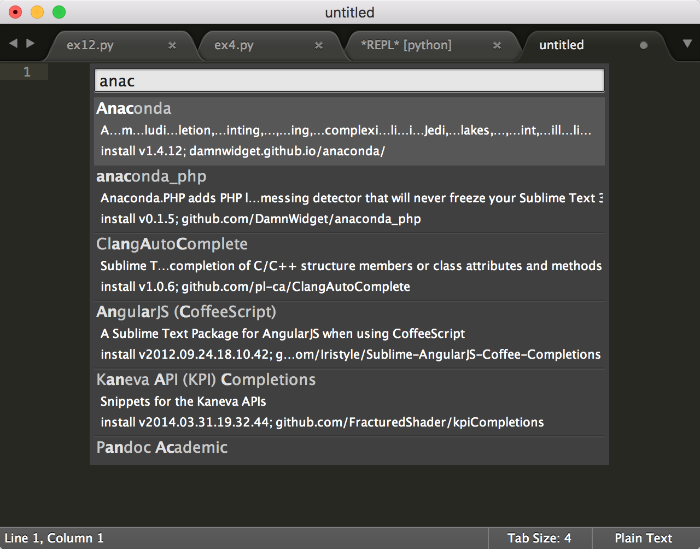

# Sublime text常用插件安装

### 安装Sublime text插件

#### 第一步：安装install Package

#### 第二步：

安装插件的方法：
1. 再次 Shift+Command+P，输入'install Package'，点击 Package Control: Install Package，
2. 输入相应的插件关键词，找到对应的插件点击安装。

以下是我安装的几个常用的插件
* Anaconda，它是Python下的 完全免费的企业级的Python发行大规模数据处理、预测分析和科学计算工具。我工作中可能会涉及到数据分析，纯个人需求。
* SublimeCodeIntel - 一个全功能的 Sublime Text 代码自动完成引擎

安装完这些插件就可以开始python代码了。

### 为什么会选择Sublime text
* 好看，颜值高，界面好看，有多重不同的代码配色方案
* 有大量的插件可以下载，可以让其变得异常强大
* 已经下载了，实在懒得再折腾其他编辑器
